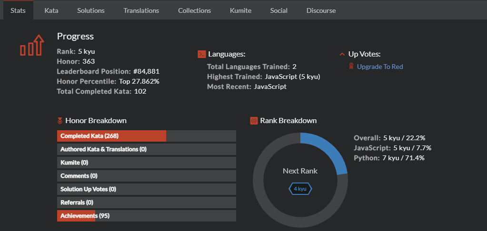

# Codewars Challenges

This is the repository for completed coding challenges from [Codewars.com](https://www.codewars.com/dashboard). These challenges have aided in conditioning my approach to many programmatic scenarios.

[Codewars Profile](https://www.codewars.com/users/WonderFilled/completed)

<!-- ## How It's Made:

**Tech used:** HTML, CSS, JavaScript, Node, Express, MongoDB

-->

<!-- ## Optimizations

Realtime statistic API calls have been reduced from initial implementation to stay under call limits. Game schedule API call happens when the first user navigates to the app on any given day and is stored for all users. -->

## Lessons Learned:

This activity in particular is dedicated to constant lessons learned -- stretching my comfort level and boundaries of C.S. theories and concepts. I have actively conditioned with primitives such as Arrays, Strings, and Objects, as well as algorithms and the operations on data structures needed for accurate solutions. My software engineering journey is an ever-unraveling experience of discovery, determination and discipline.

## Keep Exploring:

Take a look at these other examples that I have in my portfolio:

**Baseball Pitch Guesser:** https://github.com/kylemettling/BaseballPitchGuesser

**"NunGram":** https://github.com/kylemettling/theNunGram

**Tic-Tac-Toe:** https://github.com/kylemettling/tic-tac-toe-js
